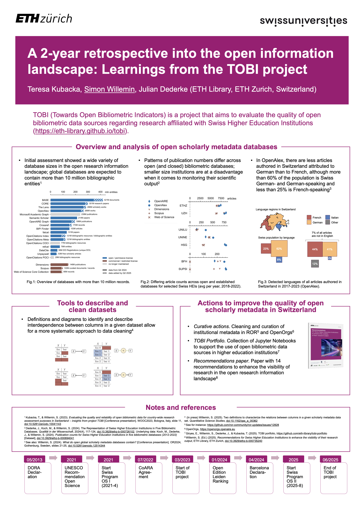

## Why it matters

TOBI (Towards Open Bibliometric Indicators) closed in July 2025 having established an important premise: despite the project name, TOBI focused primarily on the quality, coverage, and usability of open scholarly **data** rather than on promoting indicators as an end in themselves. Data quality is not a technical afterthought; it is the core infrastructure required for credible analysis and fair representation. 

NAIF continues from that same premise, but places it in a wider interoperability context. Under NAIF, the data quality conditions evaluated by TOBI become operational requirements across Swiss repositories, directly ensuring the findability and visibility of Swiss research.

## What we did

TOBI delivered comparative analyses, methods, tools, and curation work that can be reused by Swiss institutions. Using transparency principles aligned with DORA, it evaluated data provenance and methodological openness across open and commercial databases.

Building on these foundations, NAIF continues TOBI's focus in Track 3 and Track 4 by actively assessing metadata availability and quality in Swiss repositories and prioritising concrete improvement actions. To address disambiguation, NAIF actively integrates organisational and researcher identifiers—including [ROR](https://ror.org/) and [ORCID](https://orcid.org/) alignment—directly into repository workflows.

## What we found

TOBI’s analyses showed that coverage and metadata quality differ substantially across institution types and sizes in Switzerland. Key recurring issues remain: inconsistent organisation names, incomplete affiliation links, and uneven metadata completeness across systems.

The evidence clearly demonstrates that findability depends on disambiguation and consistent identifiers. Consequently, NAIF’s implementation work operates on the finding that we must shift from diagnosing identifier problems in external databases to supporting local and national processes that prevent these problems at the source.

{fig-alt="TOBI project poster titled A 2-year retrospective into the open information landscape: Learnings from the TOBI project" fig-cap="TOBI project poster presented at WOOC2025: *A 2-year retrospective into the open information landscape: Learnings from the TOBI project*. DOI: 10.5281/zenodo.15807578. Rights: Kubacka, Willemin, and Dederke (2025), CC BY 4.0."}

## What's next

While TOBI primarily answered how reliable open bibliometric sources are for Swiss higher education institutions, NAIF asks: *How do Swiss repositories and stakeholders coordinate these improvements so that national findability and interoperability become durable rather than project-bound?*

The key shift is from evidence generation to implementation design: defining who updates what data, in which systems, with which standards, and with what feedback loops. 

Moving forward, NAIF will maintain a strong analytical distinction between data readiness and indicator interpretation (Track 1) to determine what conditions must be met before indicators are compared. Findings from the four NAIF tracks are designed to feed into a national working-group model that will sustain coordination long after the project period.

## What to reuse

TOBI delivered reusable assets, including publications, datasets, code resources, practical recommendations, and curated affiliation data. NAIF continues this reuse-first approach through workshops, cross-institution dialogue, and openly shared deliverables. Key resources carrying persistent identifiers include:

- Kubacka, T., & Willemin, S. (2023). *Evaluating the quality and reliability of open bibliometric data for country-wide research assessment purposes in Switzerland*. DOI: [10.5281/zenodo.10041143](https://doi.org/10.5281/zenodo.10041143)
- Kubacka, T., Willemin, S., & Dederke, J. (2025). *A 2-year retrospective into the open information landscape: Learnings from the TOBI project* (poster). DOI: [10.5281/zenodo.15807578](https://doi.org/10.5281/zenodo.15807578)
- Dederke, J., Koch, M., & Willemin, S. (2024). *The Representation of Swiss Higher Education Institutions in Five Bibliometric Databases*. DOI: [10.3929/ethz-b-000726102](https://doi.org/10.3929/ethz-b-000726102)
- Willemin, S. (2025). *Two definitions to characterize the relations between columns in a given scholarly metadata data set*. DOI: [10.1162/qss_a_00362](https://doi.org/10.1162/qss_a_00362)
- Willemin, S. (Ed.). (2025). *Recommendations for Swiss Higher Education Institutions to enhance the visibility of their research output*. DOI: [10.3929/ethz-b-000735240](https://doi.org/10.3929/ethz-b-000735240)

## Sources

- TOBI project homepage: <https://eth-library.github.io/tobi/>