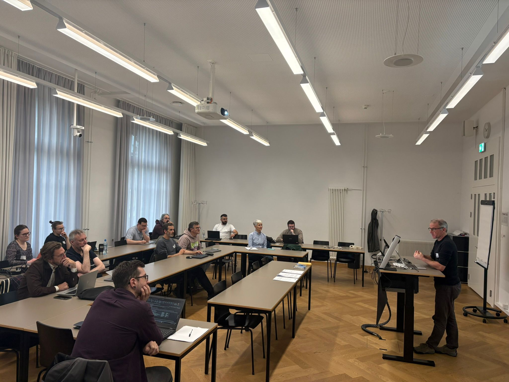
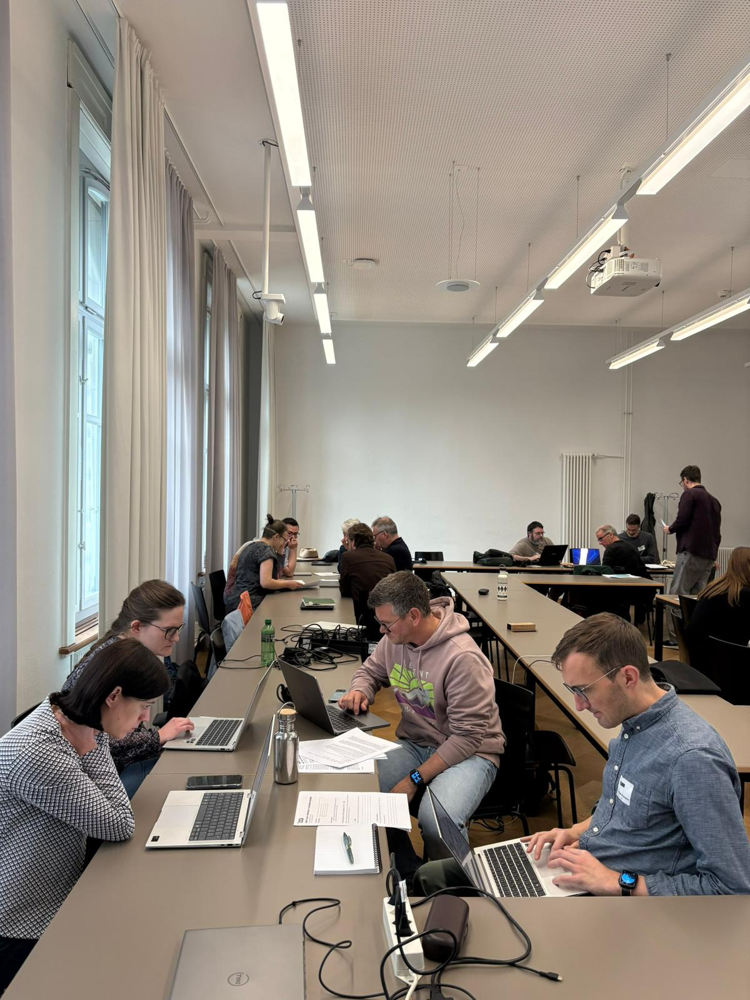

## Why it matters

Improving the interoperability of Swiss research repositories requires more than identifying problems. It also requires practical recommendations, shared priorities, and realistic implementation paths.

This was the focus of the third workshop of Track 4 of the NAIF project, held on 6 May 2026 at the University of Bern. The workshop brought together participants from across the Swiss research information and repository landscape to discuss concrete proposals for improving academic metadata and repository interoperability.

Track 4 has previously worked on mapping key challenges across different data families, including authorship data, organisational data, funding data, and Open Access metadata. The Bern workshop marked a transition from exploration to action: the aim was not to brainstorm new ideas, but to assess existing proposals and develop them into more structured recommendations.

## What we did

Ahead of the workshop, participants received eight draft proposals prepared by members of the Track 4 community. These proposals addressed issues such as persistent identifiers, institutional affiliations, Open Access reporting, funding metadata, ORCID validation, and the use of external knowledge infrastructures to improve researcher and organisational metadata.

The workshop was organised in two main parts. In the morning, participants worked in groups to critically assess the proposals. The goal was to stress-test each idea: what was clear, what was missing, what could make implementation difficult, and what should be refined, merged, narrowed, or postponed.

{fig-cap="Audience watching Christian Muheim as he presents his proposal. Photo: ETH Zurich / Cindy Hertach. Rights: NAIF project."}

In the afternoon, the discussion shifted towards implementation. Groups were asked to identify minimal viable actions, possible owners, relevant actors, concrete next steps, and realistic outputs for the coming months.

To keep the discussion focused, each group worked with a common worksheet. This helped participants move from general comments to concrete outputs, including risks, feasibility conditions, timelines, and expected deliverables.

{fig-cap="Time for group work at the NAIF Track 4 workshop. Photo: ETH Zurich / Cindy Hertach. Rights: NAIF project."}

## What we found

A key outcome of the Bern workshop was the consolidation of the eight initial proposals into four broader recommendation areas. This reflects the fact that several proposals addressed related problems from complementary angles.

For example, discussions around authorship metadata highlighted the importance of both preventing future metadata gaps and improving existing records. One approach focused on embedding ORCID validation into institutional workflows, while another explored PID-based enrichment of legacy publication records. Together, these approaches point towards a more complete strategy: improving data quality at the source while also addressing existing inconsistencies.

Other groups focused on areas such as Open Access metadata, funding-related interoperability, and organisational data. Across the discussions, some common themes emerged: the need for clearer metadata structures, better use of persistent identifiers, stronger alignment with existing standards, and implementation models that remain realistic for institutions with different systems and capacities.

The discussions also showed that technical feasibility alone is not enough. Legal, organisational, governance, and resource-related questions need to be addressed if recommendations are to become actionable.

## What's next

The work now continues towards the next Track 4 online meeting, planned for July 2026. In the meantime, the Track 4 co-leads will remain in contact with the people leading each proposal or recommendation area, to maintain momentum and support further development.

The next step is to refine the four recommendation areas into a more coherent final structure. Each recommendation should describe the problem it addresses, the proposed action, the relevant stakeholders, feasibility conditions, possible implementation steps, and a realistic timeline.

Where possible, Track 4 will also explore small pilot activities or early results that can make the recommendations more concrete. These may help test assumptions, identify practical constraints, and show what implementation could look like in real institutional contexts.

The final objective is to deliver a focused and actionable set of recommendations for the NAIF final report in November 2026. Rather than producing a general list of ideas, Track 4 aims to provide recommendations that can support future work on more interoperable, reliable, and reusable research repository metadata in Switzerland.
