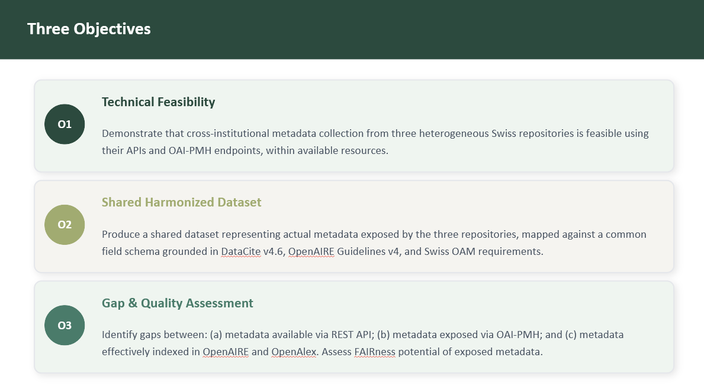
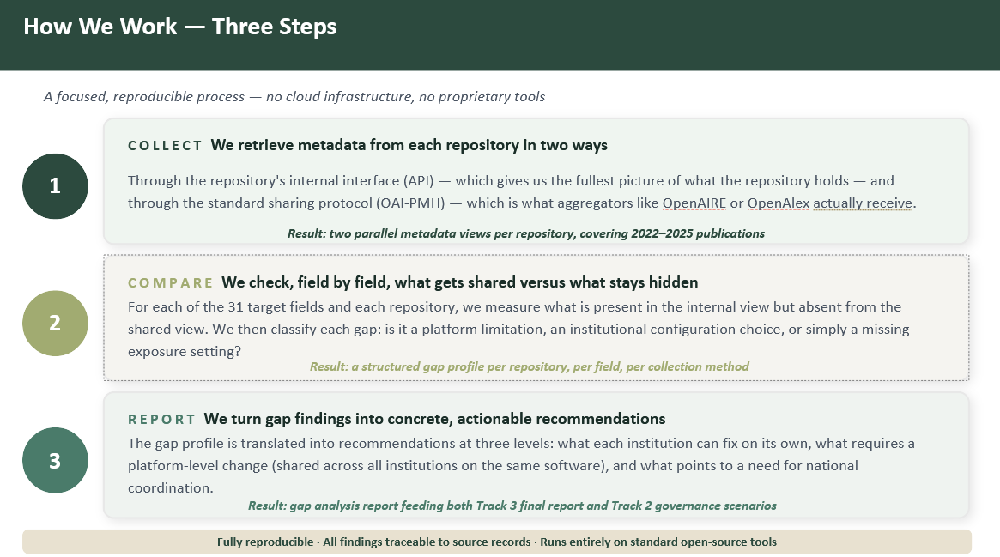

## Why it matters

In March 2026, SLiNER, in close coordination with NAIF, took a strategic decision to move forward with initial data aggregation activities. This marks a transition from conceptual discussions to practical implementation. Governance for this effort will either reside within SLiNER directly or be delegated to a dedicated working group with clearly defined responsibilities and accountability.

Within NAIF Track 2 and Track 3, and in alignment with the NAIF project lead, this decision has been translated into a concrete next step: a focused and pragmatic PrePilot for a standardised data package. The work brings together a small team from three higher education institutes: EPFL, the University of Fribourg, and the University of Zurich.

The aim is to demonstrate, through a small-scale proof of concept, that data aggregation and extraction from heterogeneous Swiss higher education repositories is technically feasible, reliable, and reproducible.

## The three objectives

{fig-cap="PrePilot objectives for data aggregation work in NAIF Track 2 and Track 3. Source: NAIF Track 2 and Track 3 working group. Rights: NAIF."}

The PrePilot focuses on three objectives:

1. Technical feasibility: demonstrate that cross-institutional metadata collection from three heterogeneous Swiss repositories is feasible using their APIs and OAI-PMH endpoints within available resources.
2. Shared harmonised dataset: produce a shared dataset representing actual metadata exposed by the three repositories, mapped against a common field schema grounded in DataCite 4.6, OpenAIRE Guidelines 4, and Swiss Open Access Monitor (OAM) requirements.
3. Gap and quality assessment: identify gaps between metadata available via REST APIs, metadata exposed via OAI-PMH, and metadata effectively indexed in OpenAIRE and OpenAlex, including an assessment of the FAIRness potential of exposed metadata.

## How the working group proceeds

The working group has initiated and planned the PrePilot as a focused, reproducible process that does not require cloud infrastructure or proprietary tools.

{fig-cap="PrePilot workflow for collecting, comparing, and reporting metadata findings. Source: NAIF Track 2 and Track 3 working group. Rights: NAIF."}

The workflow consists of three steps:

1. Collect: retrieve metadata from each repository through the repository's internal interface, such as an API, and through the standard sharing protocol OAI-PMH.
2. Compare: check field by field what is shared and what remains hidden, then classify each gap as a platform limitation, institutional configuration choice, or missing exposure setting.
3. Report: translate the findings into concrete recommendations for individual institutions, shared platform-level improvements, and areas that require national coordination.

## What's next

The setup is complete. The next steps are field mapping, data collection, alignment, and finally a gap analysis report. The working group plans to complete the final result by the end of November 2026.

The PrePilot is a collaborative effort by NAIF Track 2 and Track 3. The working group consists of Pascale Bouton, Julien Sicot, and Jorge Rodrigues de Matos from EPFL for Track 3; Andrea Malits, Martin Brändle, and Stefan Vogt from the University of Zurich for Track 2; and Thomas Henkel from the University of Fribourg as coordinator for UNIFR and working group member.
