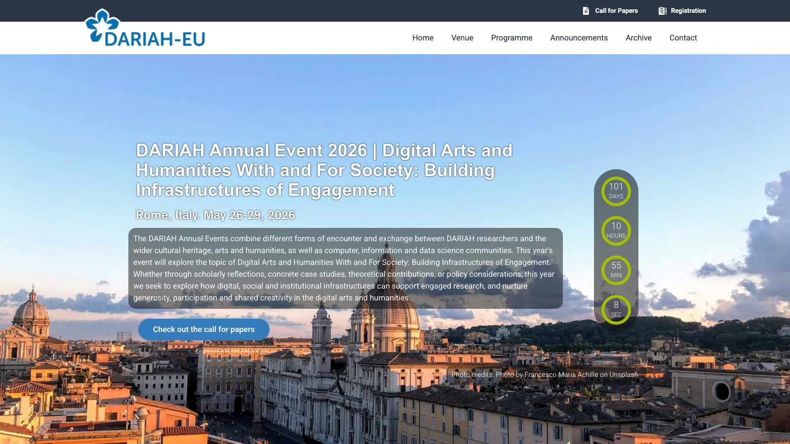
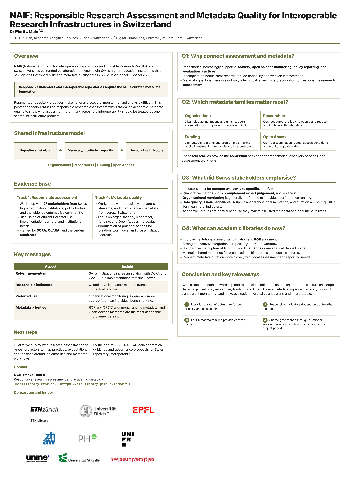

## Why DARIAH mattered

From 26 to 29 May 2026, the [DARIAH Annual Event](https://annualevent.dariah.eu/) brought researchers and practitioners to Rome under the theme "Digital Arts and Humanities With and For Society: Building Infrastructures of Engagement". The event offered a useful setting for NAIF because repository interoperability, metadata quality, and responsible assessment are not only technical concerns. They shape how research becomes visible, how it can be reused, and how institutions explain the value and limits of research information.

We presented the poster [*NAIF: Responsible Research Assessment and Metadata Quality for Interoperable Research Infrastructures in Switzerland*](https://doi.org/10.5281/zenodo.20391046), with [Dr Moritz Mähr](https://orcid.org/0000-0002-1367-1618) presenting it.

{fig-alt="Homepage visual for the DARIAH Annual Event 2026 in Rome" fig-cap="Screenshot of the DARIAH Annual Event 2026 homepage. Source: https://annualevent.dariah.eu/. Rights: DARIAH ERIC; site content licensed under CC BY where noted."}

## What we presented

We connected two NAIF work areas that are often discussed separately. Track 1 focuses on the responsible use of quantitative indicators in research assessment. Track 4 focuses on the enhancement and standardisation of academic metadata, especially organisational identifiers, researcher identifiers, funding metadata, and Open Access information.

Our central message was straightforward: **responsible indicators and interoperable repositories require the same curated metadata foundation**. Institutional repositories increasingly support discovery, open science monitoring, policy reporting, and assessment practices. If their metadata are incomplete, inconsistent, or poorly documented, both discovery and assessment become less reliable.

[{fig-alt="Poster connecting NAIF Track 1 on responsible research assessment with Track 4 on metadata quality" width="60%"}](../../posters/2026-05-26-Responsible-Research-Assessment-and-Metadata-Quality-for-Interoperable-Research-Infrastructures-in-Switzerland/poster.html)

## What we highlighted

We treated repositories as central nodes in national and international research infrastructures. They provide access to publications, datasets, and other scholarly outputs, but they also feed metadata into discovery services, open science infrastructures, and research information systems. As these metadata become part of monitoring and evaluation workflows, we must make their sources, provenance, methods, uncertainty, and limitations transparent.

For responsible research assessment, we drew on NAIF workshops with stakeholders from Swiss higher education institutions and the broader scientometrics community. Our preliminary findings emphasised that indicators must be interpreted in context, that quantitative metrics should complement expert judgement rather than replace it, and that aggregated organisational monitoring is generally more appropriate than individual-level benchmarking.

For metadata quality, we highlighted four interrelated data families:

- **Organisations:** disambiguating institutions and organisational units, including alignment with ROR.
- **Researchers:** linking outputs reliably to people through persistent identifiers such as ORCID.
- **Funding:** connecting outputs to grants, programmes, and public investment.
- **Open Access:** describing access status, dissemination routes, licences, and monitoring categories in machine-readable form.

Together, these metadata families provide the contextual backbone for repository interoperability and for the responsible interpretation of indicators derived from repository and research information systems.

## Why this matters beyond Switzerland

Although NAIF works on Swiss institutional repositories, the problem is broader. Fragmented repository practices, uneven metadata quality, and unclear governance make it difficult to build research infrastructures that are trustworthy across institutional and national boundaries. These challenges are familiar to digital humanities, cultural heritage, open science, and research information communities alike.

The DARIAH context therefore helped us frame NAIF as a Swiss case study with European relevance. We showed how academic libraries and infrastructure teams contribute to engaged research by making research outputs findable, reusable, and interpretable. This work often remains invisible precisely when it succeeds, but it is a precondition for transparent monitoring, fair assessment, and long-term visibility.

## What's next

We will continue this work through a qualitative survey with actors involved in research assessment and repository management. The survey will map institutional practices, expectations, and tensions around the use of indicators, and it will examine how repository infrastructures and metadata workflows can better support responsible evaluation.

By the end of 2026, we will deliver practical guidance and governance proposals for Swiss repository interoperability. Our poster in Rome captures one core premise for that next phase: metadata stewardship and responsible indicators should be developed together as parts of a shared sociotechnical infrastructure.
