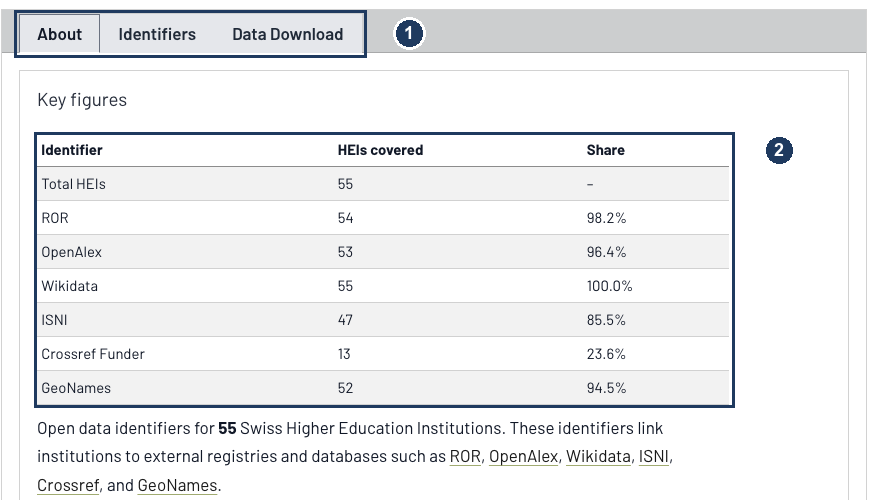
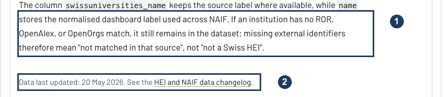
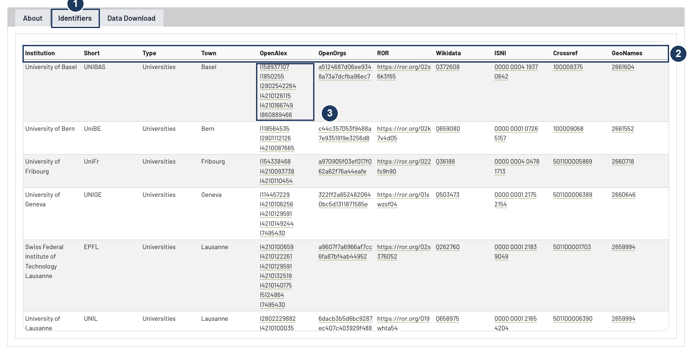
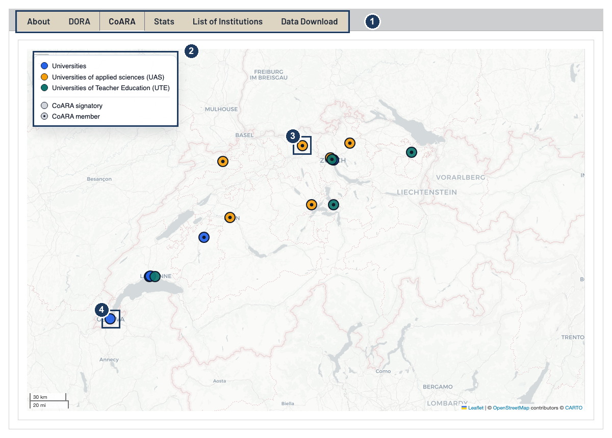
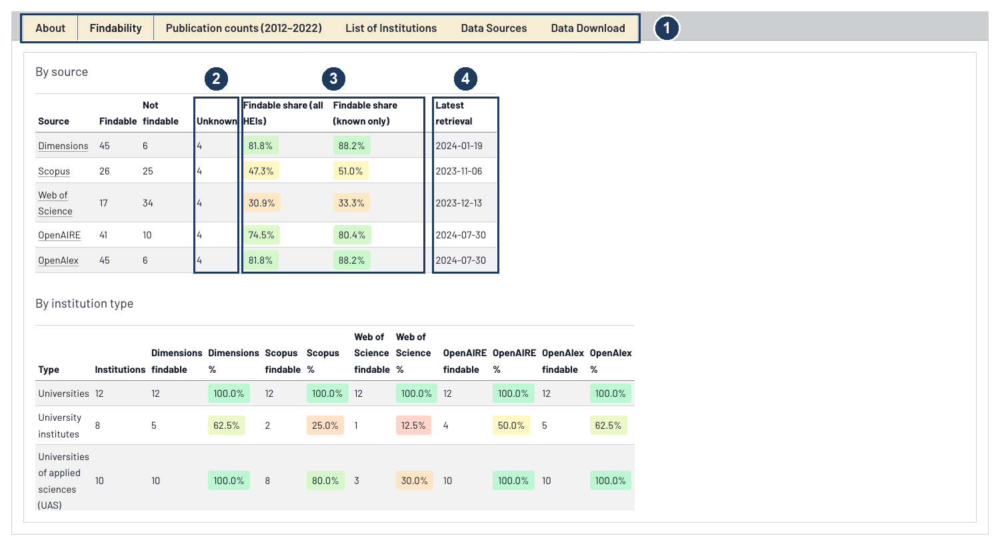
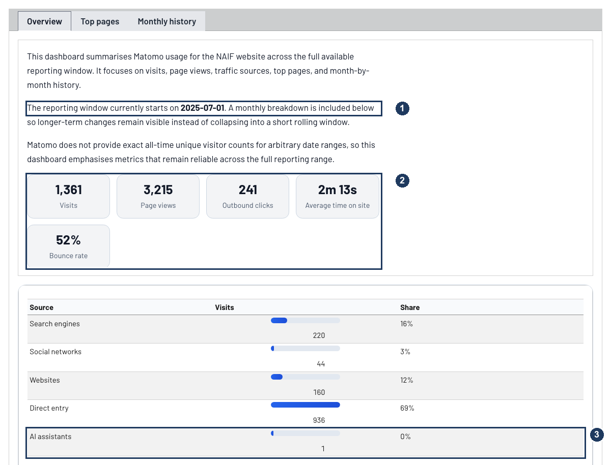

## Every dashboard is built the same way

The [Dashboards](../../dashboards/) page lists four views. They look different because they answer different questions, but three of them share one layout, and learning it once saves time on all of them.

Each dashboard is a single panel with a strip of tabs across the top. The **About** tab comes first and is the one people skip. It is also the only place that tells you how many institutions are in the dataset, how the list was assembled, what the caveats are, and when the data was last changed. The middle tabs hold the actual figures. **Data Download** comes last and hands you the whole dataset as CSV and Excel.

The Site usage dashboard is the exception: it opens straight on **Overview** and has no download tab, because it reports on this website rather than on Swiss institutions.

One thing to know before you start clicking: **the tables do not sort or filter.** They are static HTML. What they do is scroll inside their own frame while the header row stays fixed, so you can page through all 55 institutions without losing track of which column you are in. If you want to sort by institution type, or filter to a single canton, take the Excel file from the Data Download tab. It opens with the header row frozen and an autofilter already switched on for every column.

## Swiss HEI Open Data: who is findable where

This is the dashboard to start with. It answers one question: for each accredited Swiss higher education institution, which public registries and databases already have a record for it?

{fig-alt="Annotated screenshot of the About tab of the Swiss HEI Open Data Dashboard, with numbered markers on the tab strip and on the key figures table listing coverage per identifier system"}

1. **The tab strip.** Three tabs here: About, Identifiers, and Data Download.
2. **Key figures.** Coverage per identifier system, recomputed every time the site is built. As of the 20 May 2026 update, all 55 institutions have a Wikidata item and 54 have a [ROR](https://ror.org/) identifier, but only 13 have a Crossref funder identifier. That last number is not an error in the dataset. It is a real gap in Crossref, and it matters, because funder identifiers are what let you trace Swiss research funding automatically.

Further down the same tab are the two lines that change how you should read every figure above them.

{fig-alt="Annotated screenshot of two paragraphs at the foot of the About tab, with numbered markers on the sentence explaining that missing identifiers mean not matched in that source, and on the line giving the date the data was last updated"}

1. **An institution stays in the dataset even when no registry matches it.** So an empty cell means "not matched in that source", not "not a Swiss higher education institution". The coverage percentages describe the registries, not the Swiss landscape.
2. **When the data last changed**, with a link to the full changelog. More on that below.

### The Identifiers table

The Identifiers tab is the working surface. Every identifier is a live link into the registry it came from, so you can check any single value at source rather than taking the dashboard's word for it.

{fig-alt="Annotated screenshot of the Identifiers tab, with numbered markers on the active tab, the fixed header row, and a table cell containing six OpenAlex identifiers for a single institution"}

1. **The active tab.** Institution, short name, type and town, then one column per registry.
2. **The header row stays put** as the table scrolls, which is what makes an eleven-column table usable.
3. **One institution, six OpenAlex identifiers.** This is the interoperability problem in miniature. Only one of the six is the University of Basel itself; the others are the University Hospital, the Children's Hospital, the Swiss Tropical and Public Health Institute and the Friedrich Miescher Institute. "Basel's publication output" therefore means something different depending on how many of those you count, and the difference runs to tens of thousands of works. The dashboard lists all six rather than picking one, and the downloadable file keeps the university's own record separately in the `openalex_primary_id` column. Fourteen of the 55 institutions have more than one OpenAlex identifier.

::: {.callout-note}
## Explore the Swiss HEI Open Data dashboard
View it here: [Swiss HEI Open Data Dashboard](../../dashboards/swiss-hei-open-data/).
:::

## DORA and CoARA: who has committed to what

The [NAIF dashboard](../../dashboards/naif/) maps commitments to responsible research assessment. Of the 55 institutions, 24 have signed [DORA](https://sfdora.org/) and 16 have signed [CoARA](https://coara.eu/); 12 are CoARA members.

That last distinction is the one to get right, and the map encodes it in a detail that is easy to miss.

{fig-alt="Annotated screenshot of the CoARA tab showing a map of Switzerland with coloured institution markers, with numbered markers on the tab strip, the legend, a marker with a central dot, and a marker without one"}

1. **Six tabs.** Separate maps for DORA and CoARA, a Stats tab with the breakdown by institution type, the full list, and the download.
2. **The legend does double duty.** Colour encodes the type of institution; the two entries at the bottom encode the strength of the commitment.
3. **A small dark dot in the centre of a marker means CoARA member** — the institution has joined the coalition and reports on implementation.
4. **No dot means signatory only.** The commitment is public, but it carries no reporting obligation.

Read the Stats tab alongside the map. The headline counts hide a strong split by institution type, and the per-type table is where that becomes visible.

## TOBI: a frozen snapshot, to be read with care

The [TOBI dashboard](../../dashboards/tobi/) asks whether the big bibliometric databases can find Swiss institutions at all, and how many publications each one attributes to them for 2012 to 2022. It comes from the TOBI project and is deliberately **not** kept up to date: it is a historical measurement, and editing it would destroy the thing it measures.

{fig-alt="Annotated screenshot of the TOBI Findability tab, with numbered markers on the tab strip, the Unknown column, the two findable-share columns, and the latest retrieval column"}

1. **Six tabs**, including a Data Sources tab that credits each database provider.
2. **The Unknown column.** Four institutions could not be checked in any source. They are neither findable nor not findable.
3. **Two share columns, two denominators.** "Findable share (all HEIs)" counts those four unknowns against the source; "findable share (known only)" excludes them. Dimensions reads 81.8% or 88.2% depending on which question you are asking, so quoting the wrong column shifts its coverage by more than six percentage points. The colour shading is a reading aid across the row, not a rating.
4. **Latest retrieval, per source.** The dates run from November 2023 to July 2024, and they differ by source. This is the honest limit of the snapshot: Scopus was measured eight months before OpenAlex, so a small difference between those two columns may be a difference in timing rather than in coverage.

Because the snapshot is frozen, institutions that have since merged or been renamed still appear under their old names. Current institutional facts live in the Swiss HEI and NAIF dashboards; TOBI is for the 2012 to 2022 window only.

## Site usage, briefly

The [Site usage dashboard](../../dashboards/site-usage/) is the odd one out, and mostly a curiosity. It reports [Matomo](https://matomo.org/) analytics for this website.

{fig-alt="Annotated screenshot of the Site usage Overview tab, with numbered markers on the reporting window sentence, the row of metric tiles, and the AI assistants row of the traffic sources table"}

1. **The reporting window runs from 1 July 2025**, the start of the project, rather than a rolling 30 days. Every figure on the page is a cumulative total since then, which is why the numbers only ever go up.
2. **The metric tiles.** Visits, page views, outbound clicks, average time on site, bounce rate. Outbound clicks are the interesting one for a project like this: they count people leaving for a repository, a registry, or a dataset, which is closer to "did this site do its job" than page views are.
3. **AI assistants get their own referrer bucket**, next to search engines and social networks. The count is currently negligible. It is there because it seems worth watching, and you cannot watch what you have not started counting.

## How the data stays current

The four dashboards refresh in three genuinely different ways, and knowing which is which tells you how much to trust a number's freshness.

**The institutional dataset is hand-curated.** `hei.csv` is a file in the [repository](https://github.com/eth-library/naif), not an API call. It was compiled from the [swissuniversities list of accredited institutions](https://www.swissuniversities.ch/en/topics/studying/accredited-swiss-higher-education-institutions) and is corrected by hand as institutions merge, get accredited, or change name. Every change is recorded in the [HEI and NAIF data changelog](../../dashboards/data-changelog.qmd), which gives the row count before and after, what changed, what a later edit reversed, and a link to the commit. If a number looks wrong, that page will usually tell you when it became wrong.

The identifiers are audited periodically against ROR, OpenAlex and Wikidata, which produces a list of discrepancies to work through. That check only reports; it never rewrites the file. Every correction stays a deliberate edit, which is what makes the changelog worth reading.

**The usage data refreshes itself.** The Matomo snapshot is refetched from the API every time the site is published, so the Site usage dashboard is never more than one deployment old.

**The TOBI snapshot never refreshes.** By design, as above.

Spotting an error in the institutional data is a genuinely useful contribution, and the fastest route is an [issue in the repository](https://github.com/eth-library/naif/issues/new/choose). Corrections with a registry link attached are quickest to verify.

## What to reuse

Everything behind these dashboards is downloadable and openly licensed:

- **Swiss HEI baseline** — [CSV](../../dashboards/_data/hei.csv) and [Excel](../../dashboards/_data/hei.xlsx). 55 institutions with addresses, coordinates, names in German, French and Italian, DORA and CoARA status, and identifiers for ROR, OpenAlex, OpenOrgs, Wikidata, ISNI, GRID, Crossref Funder, GeoNames and swissuniversities.
- **TOBI snapshot** — [CSV](../../dashboards/_data/tobi.csv) and [Excel](../../dashboards/_data/tobi.xlsx). Findability and 2012 to 2022 publication counts across five databases, with a retrieval date per source.
- **Change history** — the [data changelog](../../dashboards/data-changelog.qmd), for citing a specific state of the dataset.

Site content is licensed CC BY; the code that builds these dashboards is AGPL. If you build something on the baseline file, please cite the changelog date you used, since the dataset moves.
